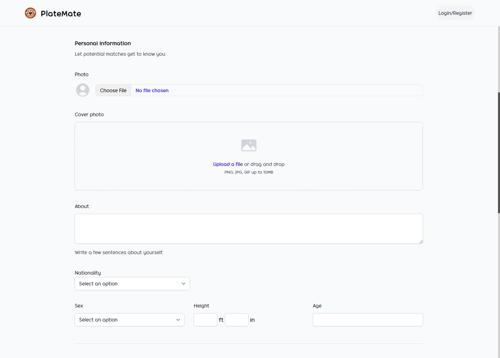
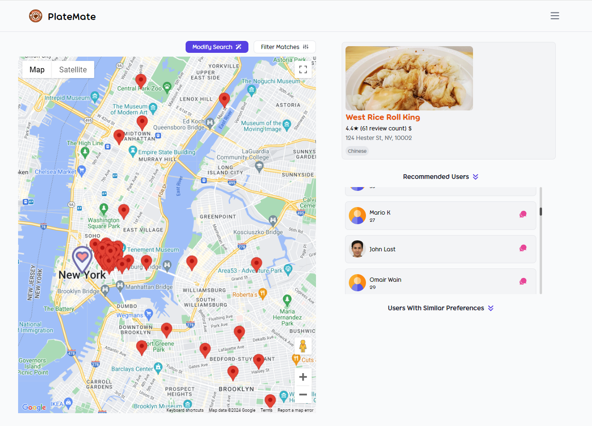
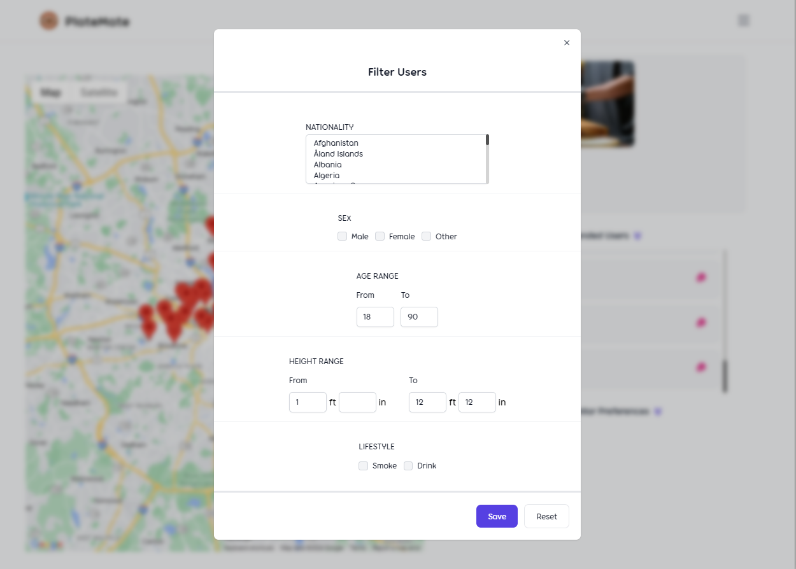

<a name="readme-top"></a>

<!--
*** I'm using markdown "reference style" links for readability.
*** Reference links are enclosed in brackets [ ] instead of parentheses ( ).
*** See the bottom of this document for the declaration of the reference variables
*** for contributors-url, forks-url, etc. This is an optional, concise syntax you may use.
*** https://www.markdownguide.org/basic-syntax/#reference-style-links
-->

<!-- PROJECT SHIELDS -->
<div align="center">

[![Contributors][contributors-shield]][contributors-url]
[![Forks][forks-shield]][forks-url]
[![Stargazers][stars-shield]][stars-url]
[![Issues][issues-shield]][issues-url]
[![MIT License][license-shield]][license-url]
<!-- [![LinkedIn][linkedin-shield]][linkedin-url] -->

<!-- PROJECT LOGO -->
<br />

  <a href="https://github.com/HafsaSarker/PlateMate">
    
  </a>

<h3 align="center">PlateMate</h3>
  <p align="center">
    A dating app that matches users based on food, location, and restaurant preferences.
    <br />
    <a href="https://github.com/HafsaSarker/PlateMate/releases">Releases</a>
    ·
    <a href="https://github.com/HafsaSarker/PlateMate/issues">Report Bug</a>
    ·
    <a href="https://github.com/HafsaSarker/PlateMate/issues">Request Feature</a>
  </p>
</div>

<br />

<!-- TABLE OF CONTENTS -->
<details>
  <summary>Table of Contents</summary>
  <ol>
    <li>
      <a href="#about-the-project">About The Project</a>
      <ul>
        <li><a href="#features">Features</a></li>
        <li><a href="#built-with">Built With</a></li>
        <li><a href="#mini-demo">Mini Demo</a></li>
      </ul>
    </li>
    <li>
      <a href="#getting-started">Getting Started</a>
      <ul>
        <li><a href="#prerequisites">Prerequisites</a></li>
        <li><a href="#installation">Installation</a></li>
      </ul>
    </li>
  </ol>
</details>

<br />

<!-- ABOUT THE PROJECT -->
## About The Project

**PlateMate** is a unique dating application that connects people through their love for food. By leveraging powerful APIs and geolocation services, PlateMate helps users find the perfect dining companions based on their food preferences and location.

### Features

* **Real-time Chatting**: Enables seamless communication between users.
* **Restaurant Selection**: Users can choose restaurants that match their food preferences.
* **User Matching**: Utilizes machine learning algorithms and user preferences to suggest potential matches.
* **Customizable Profiles**: Allows users to personalize their profiles with preferences and interests.
* **User Authentication**: Ensures secure access and data protection.

<p align="right">(<a href="#readme-top">back to top</a>)</p>

### Built With

* [![React][React.js]][React-url]
* [![Vite][Vite]][Vite-url]
* [![Flask][Flask]][Flask-url]
* [![MongoDB][MongoDB]][MongoDB-url]
* [![Python][Python]][Python-url]
* [![AWS][AWS]][AWS-url]
* [![Express][Express]][Express-url]
* [![TypeScript][TypeScript]][TypeScript-url]
* [![Google Maps API][GoogleMaps]][GoogleMaps-url]
* [![Yelp Fusion API][Yelp]][Yelp-url]

### Mini Demo

##### Register Page


##### Home Page


##### Filter Matches


<p align="right">(<a href="#readme-top">back to top</a>)</p>

<!-- GETTING STARTED -->
## Getting Started

To get a local copy up and running, follow these steps.

### Prerequisites

* npm

  ```sh
  npm install npm@latest -g
  ```

### Installation

1. Clone this repository:

   ```sh
   git clone https://github.com/HafsaSarker/PlateMate.git
   ```
   Open Directory
   
    ```sh
   cd PlateMate
   ```

3. Run the client:

   ```sh
   cd client
   ```

   Create a `.env` file in the client directory with:

   ```sh
   VITE_MAPS_API=your_google_maps_api_key
   VITE_MAP_ID=your_google_maps_api_id
   VITE_BACKEND_URL=your_backend_url
   ```

   Install NPM packages and run the development server:

   ```sh
   npm install
   npm run dev
   ```

4. Run the TypeScript server:

   Open a new terminal and navigate to the server directory:

   ```sh
   cd server
   ```

   Create a `.env` file in the server directory with:

   ```sh
   YELP_API_KEY=your_yelp_api_key
   MONGO_URI=your_mongo_uri
   SECRET=your_secret
   AWS_BUCKET_NAME=your_aws_bucket_name
   AWS_BUCKET_REGION=your_aws_bucket_region
   AWS_ACCESS_KEY=your_aws_access_key
   AWS_SECRET_ACCESS_KEY=your_aws_secret_access_key
   ```

   Install NPM packages and start the server:

   ```sh
   npm install
   npm start
   ```

5. Run server2 (for ML recommended users):

   Open a new terminal and navigate to the server2 directory:

   ```sh
   cd server2
   ```

   Create a `.env` file in the server2 directory with:

   ```sh
   MONGO_URI=your_mongo_uri
   ```

   Create a virtual environment and install required packages:

   ```sh
   python -m venv venv
   venv\Scripts\activate  # On MacOS/Linux use `source venv/bin/activate`
   pip install flask flask-cors pymongo pandas scikit-learn python-dotenv certifi
   python app.py
   ```

   To deactivate the virtual environment:

   ```sh
   deactivate
   ```

<p align="right">(<a href="#readme-top">back to top</a>)</p>

<!-- MARKDOWN LINKS & IMAGES -->
<!-- https://www.markdownguide.org/basic-syntax/#reference-style-links -->
[contributors-shield]: https://img.shields.io/github/contributors/HafsaSarker/PlateMate.svg?style=for-the-badge
[contributors-url]: https://github.com/HafsaSarker/PlateMate/graphs/contributors

[forks-shield]: https://img.shields.io/github/forks/HafsaSarker/PlateMate.svg?style=for-the-badge
[forks-url]: https://github.com/HafsaSarker/PlateMate/network/members

[stars-shield]: https://img.shields.io/github/stars/HafsaSarker/PlateMate.svg?style=for-the-badge
[stars-url]: https://github.com/HafsaSarker/PlateMate/stargazers

[issues-shield]: https://img.shields.io/github/issues/HafsaSarker/PlateMate.svg?style=for-the-badge
[issues-url]: https://github.com/HafsaSarker/PlateMate/issues

[license-shield]: https://img.shields.io/github/license/HafsaSarker/PlateMate.svg?style=for-the-badge
[license-url]: https://github.com/HafsaSarker/PlateMate/blob/master/LICENSE.txt


[React.js]: https://img.shields.io/badge/react-%2320232a.svg?style=for-the-badge&logo=react&logoColor=%2361DAFB
[React-url]: https://react.dev/

[Express]: https://img.shields.io/badge/express.js-%23404d59.svg?style=for-the-badge&logo=express&logoColor=%2361DAFB
[Express-url]: https://expressjs.com/

[Flask]: https://img.shields.io/badge/flask-%23000.svg?style=for-the-badge&logo=flask&logoColor=white
[Flask-url]: https://flask.palletsprojects.com/en/

[Vite]: https://img.shields.io/badge/vite-%23646CFF.svg?style=for-the-badge&logo=vite&logoColor=white
[Vite-url]: https://vitejs.dev/

[MongoDB]: https://img.shields.io/badge/MongoDB-%234ea94b.svg?style=for-the-badge&logo=mongodb&logoColor=white
[MongoDB-url]: https://https://www.mongodb.com/

[TypeScript]: https://img.shields.io/badge/typescript-%23007ACC.svg?style=for-the-badge&logo=typescript&logoColor=white
[TypeScript-url]: https://www.typescriptlang.org/

[Python]: https://img.shields.io/badge/python-3670A0?style=for-the-badge&logo=python&logoColor=ffdd54
[Python-url]: https://www.python.org/

[AWS]: https://img.shields.io/badge/AWS-%23232F3E.svg?style=for-the-badge&logo=amazon-aws&logoColor=white
[AWS-url]: https://aws.amazon.com/

[GoogleMaps]: https://img.shields.io/badge/Google_Maps_API-%2377B855.svg?style=for-the-badge&logo=google-maps&logoColor=white
[GoogleMaps-url]: https://developers.google.com/maps

[Yelp]: https://img.shields.io/badge/Yelp_Fusion_API-%23D32323.svg?style=for-the-badge&logo=yelp&logoColor=white
[Yelp-url]: https://docs.developer.yelp.com/docs/fusion-intro

